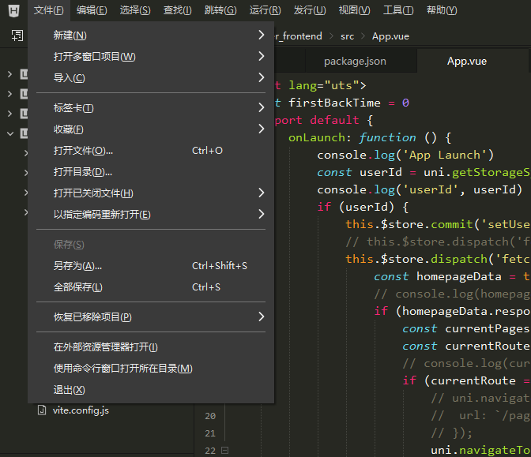
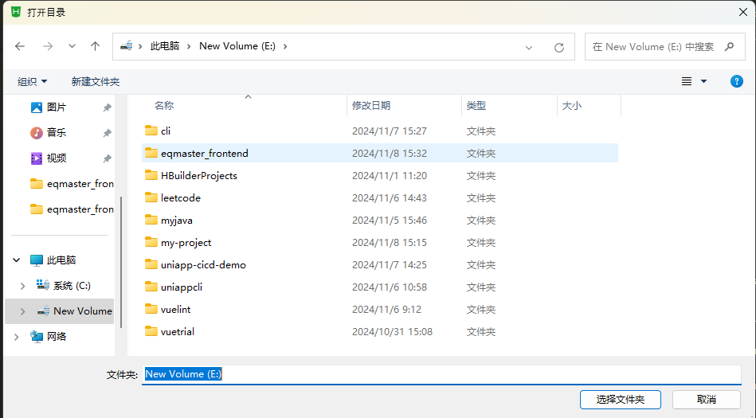
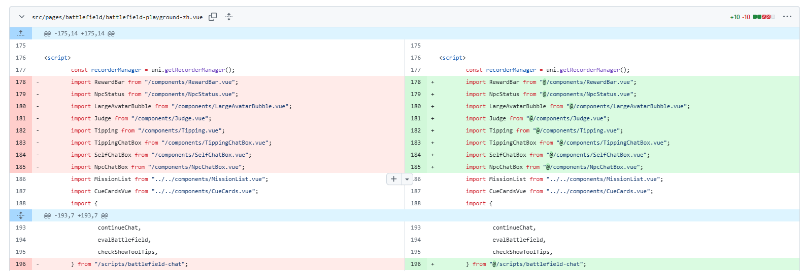

# EQMaster 

## Open With HBuilderX
Operations in HBuilderX remains unchanged after project structure migrattion, except that you need to reopen the project with directory `eqmaster_frontend`





## Install dependencies
```
npm install
```

## Build H5
```
npm run build:h5
```

## Run ESlint
```
npm run lint
```


## Notes on import paths
Absolute import path should be prefixed with `@`
