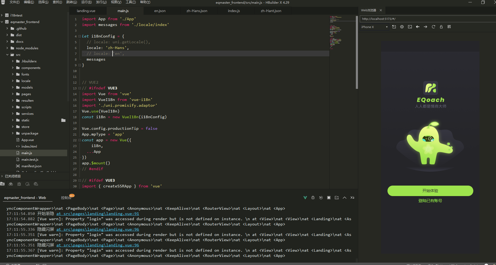
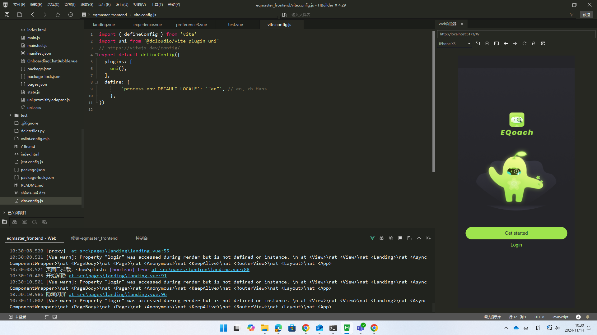

# 国际化方法

## 1. 翻译文本
国际化翻译文本存放在 `src/locale` 目录，每个语言一个`json`文件。翻译文本的值可以是字符串，也可以是图片文件路径；用以支持文本和图片内容的国际化。

```
{
	"locale.auto": "系统",
	"locale.en": "English",
	"locale.zh-hans": "简体中文",
	"locale.zh-hant": "繁体中文",

	"pages.landing.get_started": "开始体验",
	"pages.landing.login": "登陆已有账号",

	"pages.landing.greeting":  "嗨👋",
	"pages.landing.question":  "很开心见到你！你叫什么名字？",
	"pages.landing.input_name":  "设置你的用户名",
	"pages.landing.input_name_reminder":  "请输入您的名字",
	"images.startTest": "/static/onboarding/startTest-zh.png",
    "images.onboarding.landing": "/static/onboarding/landing_zh.png",

	"pages.preference.preference3.question": "让我们看看你现在适合什么情商段位!",
	"images.onboarding.startTest": "/static/onboarding/startTest3.png",
	"pages.preference.preference3.start_test": "开始测试 ↗"
}
```

## 2. vue template 内容的国际化

### 文本国际化
```html
<view class="quizButton" @click="startQuiz">
    <text class="quizText">{{ $t('pages.landing.get_started') }}</text>
</view>
```

### 图片国际化
注意`src`前面的冒号
```html
<image class="background-image" :src="$t('images.onboarding.landing')" mode="widthFix"></image>
```

### JS 代码的国际化
```JavaScript
uni.showToast({
    title: this.$t('pages.landing.input_name_reminder'),
    icon: 'none'
});
```

### `API`传递`locale`参数

使用`uni.getLocale()`获取当前的`locale`并添加到请求参数中

```JavaScript
async createProfile(profileData) {
    try {
        const locale = uni.getLocale();
        const response = await uni.request({
            url: `${API_ENDPOINT}/create_profile?locale=${locale}`,
            method: 'POST',
            data: profileData
        });

        if (response.statusCode === 200) {
            return response.data;
        } else {
            throw new Error(`Failed to create profile: ${response.statusCode}`);
        }
    } catch (error) {
        console.error('Error creating profile:', error);
        throw error;
    }
}
```

## 默认语言的配置
在`vite.config.js`文件用通过定义环境变量来控制默认的语言。注意配置中的双重引号。

```JavaScript
import { defineConfig } from 'vite'
import uni from '@dcloudio/vite-plugin-uni'
// https://vitejs.dev/config/
export default defineConfig({
  plugins: [
    uni(),
  ],
  define: {
		'process.env.DEFAULT_LOCALE': '"zh-Hans"', // en, zh-Hans
	},
})
```

语言切换后，图片和文件都切换到对应的语言。

### 显示中文版


### 显示英文版
